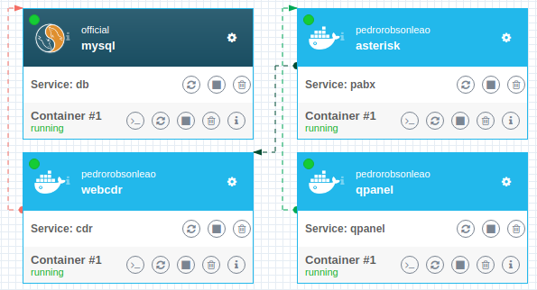
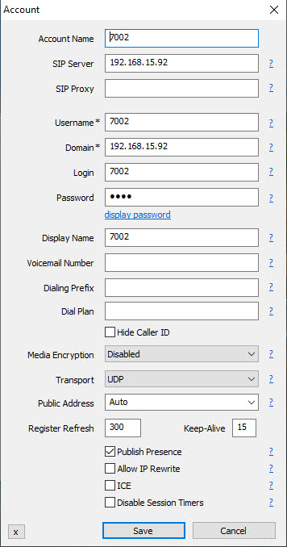

# asterisk

This is a experimental docker image to stack:

* [asterisk 16.11](https://github.com/asterisk/asterisk/tree/16.11)
* [webcdr 0.9.0](https://github.com/pedrorobsonleao/docker-webcdr)
* [qpanel 1.0.0](https://github.com/pedrorobsonleao/qpanel)

This stack create a virtual pabx with four internal phone number

## running

`docker-compose up --detach`

## internal numbers

|user|passwd|domain|
|-|-|-|
|7001|7001|ip from you server|
|7002|7002|ip from you server|
|7003|7003|ip from you server|
|7004|7004|ip from you server|

## softphone

I use [microsip softphone](https://www.microsip.org/downloads) to make a internal call between internal's.

I use this configurations:

## services

* [qpanel](http://localhost:5000)
* [webcdr](http://localhost:9030)

## more informations

see the file `docker-compose.yml`
